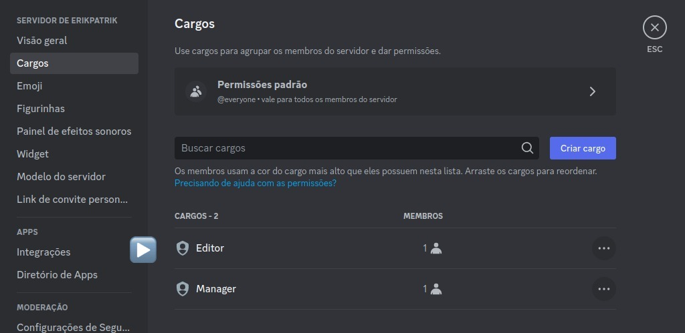
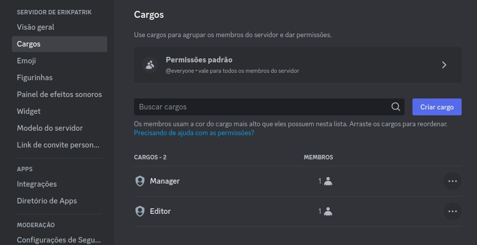
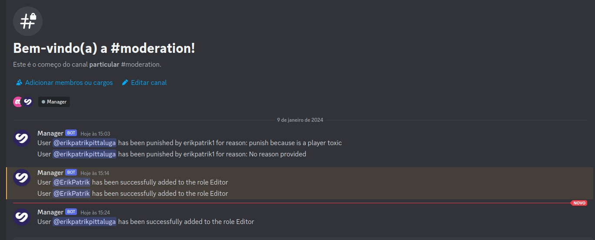
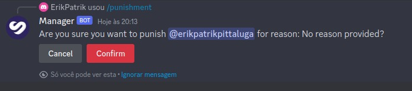
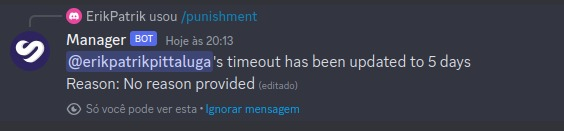
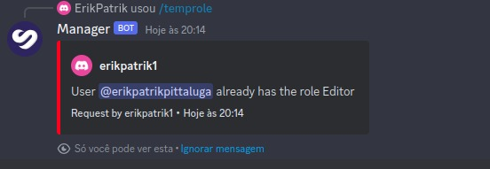

# Discord Manager


# Introduction

Welcome to the development project of the Discord Management Bot!
This project aims to create a powerful tool to assist in Discord server administration, providing useful and customizable functionalities.

# Objective

The main goal of the Bot is to simplify administrative tasks, improve interaction among server members, and offer a more personalized experience. Some features include moderation, event tracking, and more.

Of course, this project currently has only a limited set of features, but it serves as a great starting point for future implementations.

# Technologies Used
The project is developed in Node.js, leveraging the Discord.js library to interact with the Discord API.
Additionally, modern asynchronous programming techniques will be implemented to ensure efficient and responsive execution.

- Node.js (v18)
- Express.js
- Typescript
- Discord.js
- Jest
- MongoDB / Mongoose

# Getting Started

`git clone https://github.com/ErikPatrik/discord-manager.git`

# Install Dependencies:

```bash
cd discord-management-bot
npm install
npm run build
npm run dev // npm run start
```

# Observation

It is important to emphasize the creation of a .env file at the root of your project, where it should contain the following variables:

```bash
DISCORD_TOKEN=
DISCORD_CLIENT_ID=
MONGO_USER=
MONGO_PASS=
MONGO_URI=
PORT_SERVER=
```

# Added bot to your server

Copy the following link, paste it into your Discord server, and click on it; the bot will be invited.

[Bot](https://discord.com/api/oauth2/authorize?client_id=1192814832936829029&permissions=8&scope=bot+applications.commands)

<h1>Important 1</h1>

When adding the bot, you must change its role to the highest role in the server, as shown in the examples.



For this:



<h1>Important 2</h1>

Also, there may be "caches" from Discord itself, so if the "moderation" channel or any command does not appear immediately, it will appear shortly (you can try providing a command like /ban, for example).

<h3>The bot comes equipped with several functionalities to enhance server management and user interactions. Here are some of the key features:</h3>

# Banishment

- Command: `/ban`
- Description: Bans a user from the server, allowing the addition of a comment for reference.
- Options:
    - User: discord user
    - Reason (ptional): reason to ban a user

# Punishment

- Command: `/punishment`
- Description: Applies a temporary punishment to a server user for a specified duration. Users can also include a comment related to the punishment.
- Options:
    - User: discord user
    - Duration: duration the user will be punished. Examples: 1d, 1min, 3h, 20d
    - Reason (optional): reason to punish a user

# User Role Change

- Command: `/temprole`
- Description: Temporarily changes the role of a server user. Users can provide a comment regarding the user's role change.
- Options:
    - User: discord user
    - Role: new role
    - Duration (optional): time when the user will have the new role. If not informed, the default time is 30s. Examples: 1d, 1min, 3h, 20d
    - Reason (optional): reason for changing a user role

# Logging System

- Details: Upon adding the bot to a server, it automatically creates a private channel named "moderation." This channel serves as a centralized location to log and record all actions taken within the server, ensuring the moderation team stays informed.

These functionalities aim to streamline administrative tasks, improve member-server interactions, and provide a more personalized experience for server members. The project is designed to serve as a foundation, and additional features can be implemented in the future for further enhancement.

Each user interaction will also be saved in the MongoDB database.

# Images of the bot in use




